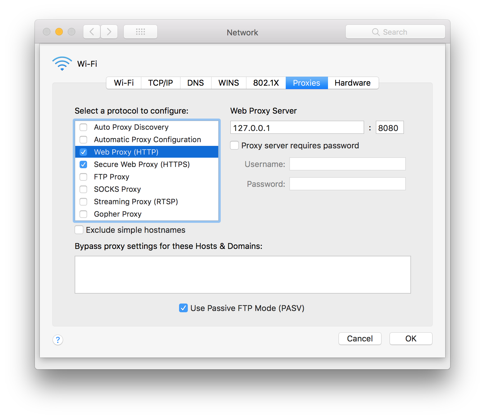
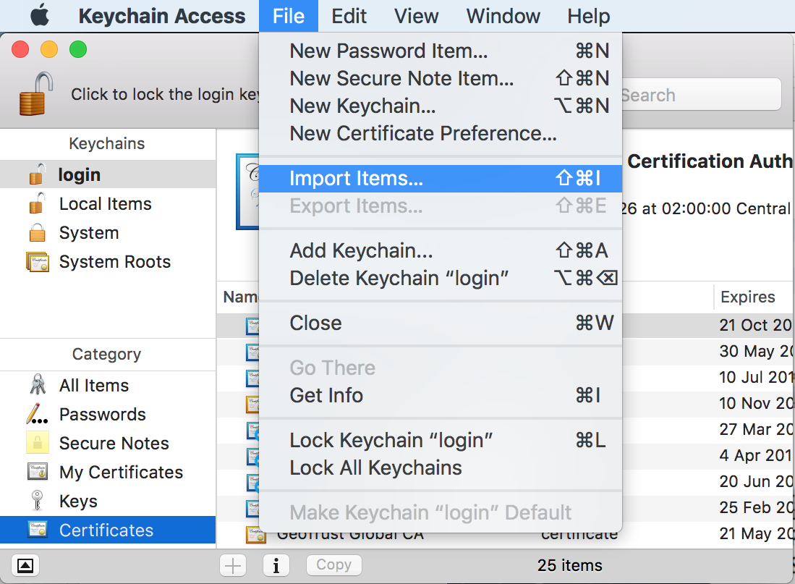

# Otiluke 

Toolbox for deploying JavaScript code transformers written in JavaScript themselves on node and browsers.

## Virus Interface

Otiluke deploys on node and browsers JavaScript code transformers expressed as *virus* modules.
Virus modules are CommonJS module which exports a function that takes an array of user-defined arguments and return JavaScript transformation function.
For instance:

```js
module.exports = (argm, callback) => {
  console.log("Virus initialized with: "+JSON.stringify(argm));
  setTimeout(() => {
    callback(null, (script, source) => [
      "console.log("+JSON.stringify("Begin "+source)+");",
      script,
      "console.log("+JSON.stringify("End"+source)+");"
    ].join("\n"));
  }, 0);
};
```

Calling context of virus functions:

```js
Virus(argm, (error, transform) => {
  if (error)
    throw error;
  script2 = transform(script1, source);
});
```

* `argm :: {string}`:
  A mapping of user-defined arguments.
  For node these are command line arguments.
  For browsers, these are 
* `script1 :: string`:
  The original script.
* `source :: string`
  * `otiluke/node`: absolute path to a node module.
  * `otiluke/browser`
    * inline script: the dom id (otiluke will create one of it does not exists) of the script element.
    * inline event handler: the dom id (otiluke will create one of it does not exists) of the target element followed by a space and the handler name.
    e.g. `"button1 onclick"`.
    * external script: absolute url.
* `script2 :: string`:
  The transformed script.
  
## OtilukeNode

OtilukeNode infects node applications by modifying the require procedure performed by node.
Examples: [test/node/run.sh](test/node/run.sh).

### `require("otiluke/node")(Virus, options={})`

* `Virus :: function`:
  Virus constructor (function exported by a virus module).
* `options :: object`
  * `_ :: [array]`
    Array of string interpreted as the command to launch the node process to be infected.
    For instance: `["main.js", "foo", "bar"]`.
  * `...`:
    Remaining properties will be used to compute argument mapping `argm` passed to `virus`.

Alternatively, if Otiluke is installed globally, the `otiluke-node` command can be used:

```
otiluke-node --virus <path> ... -- <command>`
```

For instance: `otiluke-node --virus virus.js --foo=123 --bar=456 -- main.js --qux=789` will result into `{foo:123, bar:456}` being passed to the `virus.js` module, while `node main.js --qux=789` will be used to launch the node process to be infected.

## OtilukeBrowser

OtilukeBrowser modifies html pages served over http(s) by performing a man-in-the-middle attack with a forward proxy.
Such attack requires the browser to redirect all its requests to the forward proxy.
For pages securely served over https it also requires the browser to trust the self-signed certificate, by default at [browser/ca-home/cert.pem](browser/ca-home/cert.pem).
Examples: [test/browser/run-hello.sh](test/browser/run-hello.sh) and [test/browser/run-google.sh](test/browser/run-google.sh).

### `require("otiluke/browser/ca")(options={})`

This function prepares a directory to serve as the home directory of a certificate authority.

* `options["ca-home"] :: string`, default `"node_modules/otiluke/browser/ca-home"`:
  The  directory will be populated with the subdirectories: `req`, `key` and `cert` and the files: `req.pem`, `key.pem`, `cert.pem` and `serial.srl`.
* `options["subj"] :: string`, default `"/CN=otiluke/O=Otiluke"`:
  The `-subj` argument to pass to [`openssl -req`](https://www.openssl.org/docs/manmaster/man1/req.html).

Alternatively, if Otiluke is installed globally, the following command can be used:

```
otiluke-browser-ca [--ca-home <path>] [--subj arg]
```

**Warning**
Making a browser trust a root certificate has *serious* security consequences.
Everyone having access to the corresponding private key can falsify *any* identity on that browser (which is exactly what OtilukeBrowser needs to do).
To avoid security breach, we recommend to use a dedicated browser and *never* fill in it any sensitive information.

### `listeners = require("otiluke/browser/proxy")(vpath, options={})`

Create listeners for a man-in-the-middle proxy.

* `vpath :: string`:
  Path to a virus module.
* `options["ca-home"] :: string`, default `"node_modules/otiluke/browser/ca-home"`
  Path to a certificate authority home directory.
* `options["socket-dir"] :: string`, default `$TMPDIR` (`"\\?\pipe"` on windows).
  Address namespace for local sockets (aka named piped in windows).
* `options["argm-prefix"] :: string`, default `"otiluke-"`:
  Prefix to look for in the search part of the url to create the `argm` object.
  For instance, the url `http://example.com/path?otiluke-foo=123&otiluke-bar=456&qux=789` will result into `{foo:123, bar:456}` being passed to the virus module.
* `options["global-var"] :: string`, default `__OTILUKE__`.
  Global variable used to store the transformation function.
* `options["handlers"] :: object`, default `{}`.
  A set a function defined by the user to monitor Otiluke's activity and intercept traffic.
  In particular, these handlers can be used to filter out information gathered by the virus module.
  * `handled = handlers.request(request, response)`
    Called whenever a regular request is intercepted by either the proxy or one of the forged servers.
    Unless this function return a truthy value, Otiluke will forward the regular request to the rightful address.
    * `request :: http(s).IncomingMessage`
    * `response :: http(s).ServerResponse`
    * `handled :: boolean`
  * `handled = handlers.connect(request, socket, head)`
    Called whenever a connect request is intercepted by one of the forged servers.
    Unless this function return a truthy value, Otiluke will forward the connect request to the rightful address and blindly relay subsequent traffic.
    * `request :: http(s).IncomingMessage`
    * `socket :: (net|tls).Socket`
    * `head :: Buffer`
    * `handled :: boolean`
  * `handled = handlers.upgrade(request, socket, head)`
    Called whenever a connect request is intercepted by either the proxy or one of the forged servers.
    Unless this function return a truthy value, Otiluke will forward the upgrade request to the rightful address and blindly relay subsequent traffic.
    * `request :: http(s).IncomingMessage`
    * `socket :: (net|tls).Socket`
    * `head :: Buffer`
    * `handled :: boolean`
  * `forgery(hostname, server)`
    Called whenever a hostname is being impersonated.
    * `hostname :: string`
    * `server :: https.Server`
  * `activity(description, origin, emitter)`
    Called whenever an event emitter is created.
    * `description :: string`
      One of the string:
      * `"server-regular-request"`
      * `"client-regular-request"`
      * `"server-regular-response"`
      * `"client-regular-response"`
      * `"server-connect-request"`
      * `"server-connect-socket"`
      * `"client-connect-socket"`
      * `"server-upgrade-request"`
      * `"server-upgrade-socket"`
      * `"client-upgrade-socket"`
    * `origin :: http(s).Server`
      Either the proxy server or one of the forged server.
    * `emitter :: http(s).IncomingMessage | http(s).ClientRequest | http(s).ServerResponse | (net|tls).Socket`
* `listeners :: object`
  Object containing event listeners which should be attached to a user-created `http.Server` to setup the man-in-the-middle attack.
  * `listeners.request(request, response)`
  * `listeners.upgrade(request, socket, head)`
  * `listeners.connect(request, socket, head)`

Alternatively, if Otiluke is installed globally, the following command can be used:

```
otiluke-browser-proxy --vpath=<path> --port=<number> [--ca-home=<path>] [--socket-dir=<path>] [--global-var=<token>] [--argm-prefix=<token>]
```

### Redirect the browser requests to the man-in-the-middle proxy

#### Firefox

Go to `about:preferences`, at the bottom of the *General* menu, click on *Settings...*.
Tick the checkbox *Manual proxy configuration* and *Use this proxy server for all protocols*.
The *HTTP Proxy* field should be *localhost* and the *Port* field should refer to the port to which is the proxy is listening. Make sure that loopback addresses such as `localhost` and `127.0.0.1` are not present in the field *No Proxy for*.


#### Chrome

Use the `--proxy-server` switch.
For instance, on OSX:

```
/Applications/Google\ Chrome.app/Contents/MacOS/Google\ Chrome --proxy-server=127.0.0.1:8080
```

#### System

Changing the system-level proxy settings would also work but it will redirect *every* http(s) request performed by your system.
In OSX, system-level proxy settings are available in: `System Preferences` > `Network` > `Advanced...` > `Proxies`.



### Make browsers trust Otiluke's root certificate

This step is only required if you need to infect html pages securely served over https.

#### Firefox

Go to `about:preferences`, at the bottom of the *Privacy & Security* menu, click on *View Certificates*.
Import Otiluke's root certificate an restart Firefox to avoid `sec_error_reused_issuer_and_serial` error.


#### System

Otiluke's root certificate can also be trusted at the system level but that means that *every* browser will trust Otiluke's signed certificate.
If your certificate authority directory is compromised, data can be stolen from each one of your browsers.
In OSX, go to `Keychain Access` > `Files` > `Import Items` and select Otiluke's root certificate.


