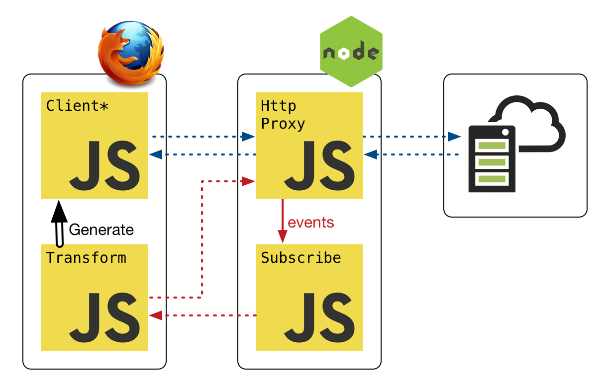
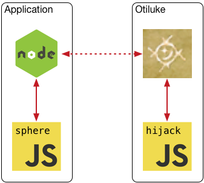
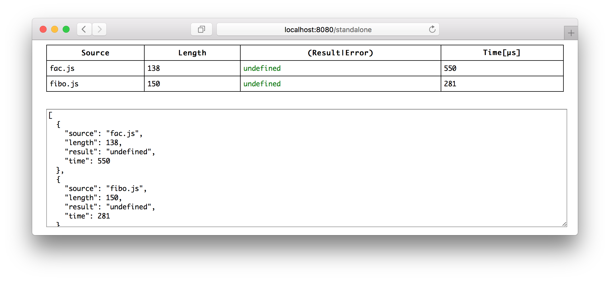
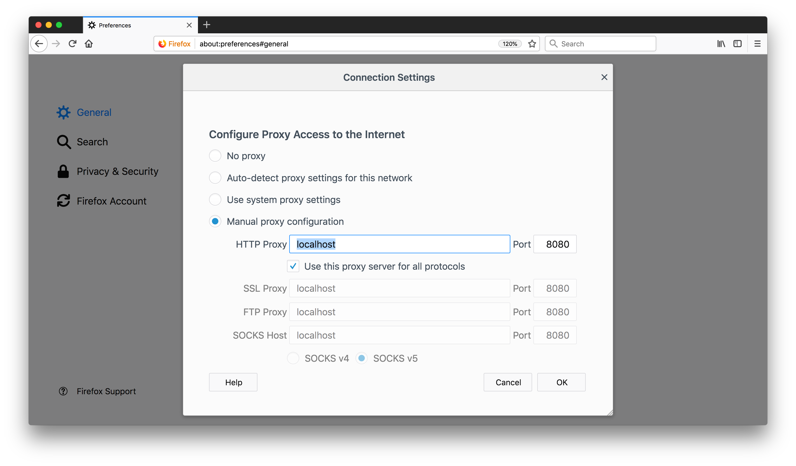
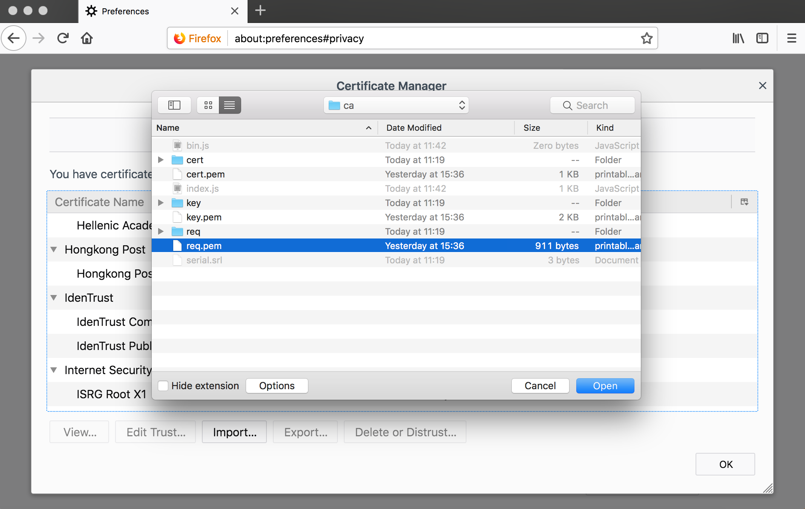
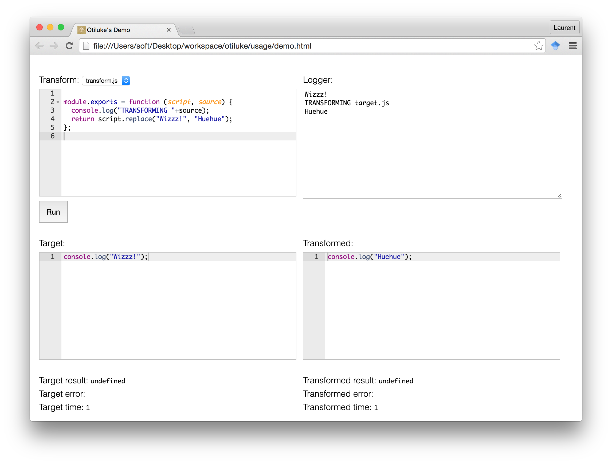

# Otiluke 

Otiluke is a toolbox for ECMAScript5 code instrumenters.
After deployment, the instrumented application can communicate to the outside world via a channel provided by Otiluke.
Otiluke is itself a [npm module](https://www.npmjs.com/package/otiluke) and can be installed with `npm install otiluke`.
Otiluke features four tools:

Tool          | Target             | Intended Purpose                    | Channel          | Usage Example
--------------|--------------------|-------------------------------------|------------------|---------------------------
[Mitm](#mitm) | served html pages  | instrument client tiers of web apps | auxillary server | `node example/run-mitm.js`
[Node](#node) | node module        | instrument node applications        | auxillary server | `node example/run-node.js`
[Test](#test) | standalone scripts | debug and benchmark an instrumenter | auxillary server | `node example/run-test.js`
[Demo](#demo) | standalone scripts | debug and demonstrate instrumenters | simple logger    | `node example/run-demo.js`

## Mitm

Otiluke instruments served html pages by essentially performing a man-in-the-middle attack with a forward proxy.
Such attack requires the browser to redirect all its request to the forward proxy.
For pages served https it also requires the browser to trust the self-signed certificate at [mitm/proxy/ca/cert.pem](mitm/proxy/ca/cert.pem).
We detail this procedure for firefox [here](#browser-configuration).

<p align="center"></p>

After deployment, the sphere has been [browserified](http://browserify.org) into the client tier.
The Otiluke proxy is parametrized by an object called *hijack* which intercept the communication from the client tier.
The above schema depicts a typical use case where the sphere module and the hijack object only communicate with eachother.
But nothing prevent the sphere module to communicate with the server tier and/or the hijack object to handle communication directed to the server tier.
Note that multiple clients can be connected at the same time.
You can try out the mitm tool be executing `node example/run-mitm.js` from the installation repository of this module.
Here are the important file involved in this example:
* [example/run-mitm.js](example/run-mitm.js):
  Deploy an Otiluke mitm proxy as well as a static file server.
  The string referred by `splitter` is used to distinguish the sphere communication from the rest.
  It is randomly generated and passed to the sphere module and the hijack object.
* [example/sphere.js](example/sphere.js):
  A simple JS transpiler written as a sphere that send http post requests before and after executing any script.
* [example/hijack.js](example/hijack.js):
  Exports an object intercepting the communicaton from the transpiled application and logging http requests from the sphere.

```js
server = Otiluke.mitm({
  hijack: hijack,
  sphere: {
    path: path,
    argument: argument
  }
});
server.listen(port);
```

* `hijack(object)`: an object intercepting communication from the transpiled application.
  * `hijack.request(function)`: intercept http(s) exchanges
  * `hijack.socket(function)`: intercept websockets
* `path(string)`: path to the sphere module
* `argument(json)`: static json data that will be passed to every deployed sphere.
* `server(http.Server)`: forward proxy which acts as a man-in-the-middle.
* `port(number)`: port on which the forward proxy should listen 

N.B.:
* To handle https connection, [Mitm](#mitm) requires [openssl](https://www.openssl.org/) to be available in the PATH.
* External and inlined script are intercepted but *not* inline event handlers nor dynamically evaluated code.
* You can refresh every Otiluke certificates by calling `Otiluke.mitm.reset(function (error) { ... })`.
  After resetting you will have to make your browser trust the new randomly created root certificate.

## The Sphere Module and the Hijack Object

An important design decision of Otiluke consists in providing an unified interface for deploying JS transpilers.
The communication model described in [Mitm](#mitm) motivates the interface for the tools [Node](#node) and [Test](#Test).
We now describe how sphere modules and hijack objects should look like for every Otiluke tools but [Demo](#demo).

1. Sphere Module: a node module performing JS transpilation:
  ```js
  module.exports = function (argument, channel) {
    return function (script, source) {
      var transpiled = ...;
      return transpiled;
    };
  };
  ```
  * `argument(json)`: static JSON data passed when calling Otiluke's tools.
  * `channel(channel-uniform)`: instance of [channel-uniform](https://www.npmjs.com/package/channel-uniform) directed to an Otiluke server.
  * `script(string)`: original code
  * `source(string)`: origin of the script, can be an url or a path.
  * `transpiled(string)`: transpiled script
2. Hijack Object: an JS object intercepting the communication from the transpiled application
  ```js
  var hijack = {};
  hijack.request = function (req, res) {
    var hijacked = ...;
    return hijacked;
  };
  hijack.websocket = function (ws) {
    var hijacked = ...;
    return hijacked;
  };
  ```
  * `req(http.IncomingMessage)`: http(s) request
  * `res(http.ServerResponse)`: http(s) response
  * `ws(ws.WebSocket)`: websocket
  * `hijacked(boolean)`: indicates whether the request/websocket was handeled.

## Node

Otiluke deploys spheres to node applications by modifying the require processus performed by node.
This tool does two things:
First it launches a server parametrized by a hijack object.
Second it computes command line arguments that should be inserted into commands launching node applications.
For instance, `node main.js arg0 arg1` should be changed into `node <otiluke-argv> main.js arg0 arg1` where `<otiluke-argv>` is a placeholder for the aforementionned command line arguments.

<p align="center"></p>

After deployment, the sphere module has been required into the node application and can communicate with the hijack object.
As for [Mitm](#mitm), multiple node applications can be connected at the same time.
You can try out the mitm tool be executing `node example/run-node.js` from the installation repository of this module.
The main file of this example, [node example](example/run-node.js), reuses [sphere.js](example/sphere.js) and [hijack.js](example/hijack.js) from the mitm example.

```js
var server = Otiluke.node.server(hijack)
server.listen(port);
var argv = Otiluke.node.argv({
  path: path,
  argument: argument,
}, port);
```

* `hijack(object)`: idem as `Otiluke.mitm`
* `path(string)`: path to the sphere module
* `argument(json)`: static json data that will be passed to every deployed sphere.
* `server(http.Server)`: forward proxy which acts as a man-in-the-middle.
* `port(number)`: port on which the forward proxy should listen 

* `hijack(object)`: same as the one given to `Otiluke.mitm`
* `server(http.Server)`: Http server 
* `path(string)`: path to the sphere module
* `argument(json)`: 
* `port(number)`:
* `argv(array)`: command line arguments to prepend before

## Test

This tool deploys a server for debugging and benchmarking spheres.
Upon receiving a http request to a directory, this server will bundle every `.js` files present in the directory and return them along with a predifined sphere.   
Below is the [test example](example/run-test.js) which reuses [sphere.js](example/sphere.js) and [hijack.js](example/hijack.js) from the mitm example.

```js
Otiluke.test({
  basedir: basedir,
  hijack: hijack,
  sphere: {
    path: path,
    argument: argument
  }
}).listen(port);
console.log("visit: http://localhost:8080/standalone");
```



## Demo

The demo tool is the only one that does not requires an auxiliary Otiluke server.
Which comes at the cost of losing some of the feature accessible to generic spheres.
The subclass of sphere accepted by the demo tool are called *log-spheres* which accept a simple logging function instead of the very generic `argument` and `channel`.
Here are the important file involved when executing `node example/run-demo.js`: 

* [run-demo.js](example/run-demo.js)
  ```js
  var Path = require("path");
  var Fs = require("fs");
  var Otiluke = require("otiluke");
  Otiluke.demo({
    "log-sphere": Path.join(__dirname, "log-sphere.js"),
    target: Path.join(__dirname, "standalone")
  }, function (error, html) {
    if (error)
      throw error;
    Fs.writeFileSync(Path.join(__dirname, "demo.html"), html, "utf8");
  });
  console.log("visit: file://"+Path.join(__dirname, "demo.html"));
  ```
* [log-sphere.js](example/log-sphere.js) 
  ```js
  var namespace = "_otiluke_";
  module.exports = function (log) {
    global[namespace] = log;
    return function (script, source) {
      return [
        namespace+"("+JSON.stringify("before "+source+"\n")+");",
        script,
        namespace+"("+JSON.stringify("after "+source+"\n")+");"
      ].join("\n");
    };
  };
  ```


Essentially the very generic couple `argument` and `channel` has been replace by a single logging function.


The downside 

Unlike the other tools, this tool does not requires an 
This last tool output html code which can be executed without server.

`otiluke --demo` [browserifies](http://browserify.org/) the given transpiler(s) and bundles the standalone script(s) into a standalone html page.
This page serves as a demonstration to these awesome transpiler(s) of yours.
Note that only the dependencies initially present in the given transpiler(s) will be bundled into the page, therefore arbitrary requires are not supported in the demo page.

```
var Path = require("path");
var Fs = require("fs");
var Otiluke = require("otiluke");
Otiluke.demo({
  "log-sphere": Path.join(__dirname, "log-sphere.js"),
  target: Path.join(__dirname, "standalone")
}, function (error, html) {
  if (error)
    throw error;
  Fs.writeFileSync(Path.join(__dirname, "demo.html"), html, "utf8");
});
console.log("visit: file://"+Path.join(__dirname, "demo.html"));
```

```shell
otiluke --demo --transpile path/to/transpile[.js] --main path/to/main[.js] --out path/to/bundle.html
```
```javascript
require("otiluke").demo({
  transpile: "path/to/transpile",
  main: "path/to/main",
  out: "path/to/bundle.html"
});
```
## Subspheres

## Browser Configuration

### Redirect Firefox requests to the mitm proxy

First, you have to redirect all Firefox requests to the local port where the proxy from Otiluke mitm has been deployed.
Go to `about:preferences#advanced` then click on *Network* then *Settings...*.
You can now tick the checkbox *Manual proxy configuration* and *Use this proxy server for all protocols*.
The HTTP proxy fields should be the localhost `127.0.0.1` and the port on which proxy from the Otiluke mitm is listening.



### Make Firefox trust Otiluke's root certificate

Second, you have to indicate Firefox that you trust Otiluke's root certificate.
This step is only required if you need to transpiled clients securely served via https.
Go agains to `about:preferences#advanced` then click on *Certificates* then *View Certificates*.
You can now import Otiluke's root certificate which can be found at `/path/otiluke/mitm/ca/cacert.pem`.
After changes in certificates' trust, restart Firefox to avoid `sec_error_reused_issuer_and_serial` error.



### Discussion on security

Making a browser trust a root certificate has dire security consequences.
Everyone having access to the corresponding private key can insurpate *any* identity within this browser.
Which is exactly what Otiluke mitm needs to do.
There is two ways approach this:
1. Not caring about security by using a dedicated browser and never fill in it any sensitive information (preferred).
2. Reset Otiluke certificate `Otiluke.mitm.reset(function (error) { ... })` to generate a new random private root key that must never be compromised.
   However the private root key is stored in plain (here)[mitm/proxy/ca/cakey.pem] because it needs to be accessed by Otiluke to sign new certificates.
   So makes sure that *absolutely* no one can access this file.


To make your transpiler work with Otiluke they should follow the template below.
We call such node module *sphere*.

```javascript
module.exports = function (argument, channel) {
  return function (script, source) {
    var transpiled = ...;
    return transpiled;
  };
};
```

* `argument(json)`: static JSON data passed when calling Otiluke's tools.
* `channel(channel-uniform)`: instance of [channel-uniform](https://www.npmjs.com/package/channel-uniform)
* `script(string)`: the original code
* `source(string)`: the origin of the script
* `transpiled(string)`: the transpiled script

The goal of the `channel` argument is to create a medium to communicate data to the external world.
It points to an Otiluke server which is parametrized by an object following the template below.
We call such object *hijack*

```
var hijack = {};
hijack.request = function (req, res) {
  var hijacked = ...;
  return hijacked;
};
hijack.websocket = function (ws) {
  var hijacked = ...;
  return hijacked;
};
```

* `req(http.IncomingMessage)`: 
* `res(http.ServerResponse)`: 
* `ws(ws.WebSocket)`: an 
* `hijacked(boolean)`: indicates wheter the request/websocket was intercepted.

For instance the sphere below modifies every intercepted script by adding log call before and after evaluating the script.

```javascript
var namespace = "_otiluke_namespace_";
module.exports = function (argument, tunnel) {
  global[namespace] = function (message) {
    tunnel.request("POST", "/_otiluke_splitter_", {}, message, true);
  };
  return function (script, source) {
    return [
      namespace+"("+JSON.stringify("begin "+source)+");",
      script,
      namespace+"("+JSON.stringify("end "+source)+");",
    ].join("\n");
  };
};
```

```
var Url = require("url");
var hijack = {};
hijack.request = function (req, res) {
  if (Url.parse(req.url).path !== "/_otiluke_splitter_")
    return false;
  var message = "";
  req.on("data", function (data) { message += data });
  req.on("end", function () {
    console.log(message);
  });
  return true;
};
```


The sphere interface suppose to have deploy a server 
is very generic and in many case only part.
For instance, a simple log channel is sufficient for many dynamic analysis.

```javascript
module.exports = function () {
  return function (script, source) {
    return [
      namespace+"("+JSON.stringify("begin "+source+"\n")+");",
      script,
      namespace+"("+JSON.stringify("end "+source+"\n")+");",
    ].join("\n");
  };
};
```

## Otiluke --node

`otiluke --node` deploys transpiler on node application(s).
Before being executed, every required module is intercepted and passed to the transpiler.
This transpilation process should work just fine in most cases but may not resist (yet) throughout introspection of the node module system.
For process lovers: `require("child_process").fork` is used with inherited standard streams.

```shell
otiluke --node --log-sphere /path/to/log-sphere.js --port 8080
```

Deploy a dedicated server:

```javascript
var Otiluke = require("otiluke");
var hijack = {
  request: function (req, res) { ... },
  socket: function (socket) { ... }
};
var sphere = {
  argument: 
};
var server = Otiluke.node.server(hijack);
server.listen(port);
var argv = Otiluke.node.argv()

  transpile: "path/to/transpile",
  main: "path/to/main",
  log: "path/to/log"
});
```

The transpiler module will always be executed side-by-side with the program targeted for transpilation.
Such online transpilation process enables easy support of dynamic code evaluations such as [`eval(script)`](https://developer.mozilla.org/en-US/docs/Web/JavaScript/Reference/Global_Objects/eval).
As illustrated below and [here](http://rawgit.com/lachrist/otiluke/master/example/demo.html), Otiluke provides a log channel in the options argument to trace information gathered during the transpilation process or later, while executing the transpiled program.



Otiluke's tools often understand the following important arguments: `--transpile` which points to the transpiler, `--main` which points to the entry point of the program to be transpiled, and `--log` which points to a log file for collecting the data sent through `Otiluke.log(string)`.
As demonstrated below, Otiluke's tools can often perform several transpilations at once if these arguments point to directories instead of files.
In such case, the resulting transpilations are the results of a [cartesian product](https://en.wikipedia.org/wiki/Cartesian_product) of the JavaScript files directly contained inside the `--transpile` and `--main` directory.
If `--log` points to a directory, Otiluke creates a new log file inside of it for every transpilations.
The names of these log files are URLs containing [hexadecimal escape sequences](https://mathiasbynens.be/notes/javascript-escapes#hexadecimal).
This illustrated below with Otiluke's test:


```javascript
> require("fs").readdirSync("./example/log").map(function (name) { return eval("'"+name+"'") })
[ '.gitignore',
  '/fac.js?transpile=identity.js#0',
  '/fac.js?transpile=logsource.js#0',
  '/fibo.js?transpile=identity.js#0',
  '/fibo.js?transpile=logsource.js#0' ]
```

Before going to each tool in detail, the table below recapitulates the options understood by each tool:

&nbsp;&nbsp;&nbsp;Argument&nbsp;&nbsp;&nbsp; | Shortcut | &nbsp;&nbsp;&nbsp;&nbsp;&nbsp;&nbsp;&nbsp;&nbsp;&nbsp;Tool&nbsp;&nbsp;&nbsp;&nbsp;&nbsp;&nbsp;&nbsp;&nbsp;&nbsp; | Description
--------------|----------|-------------------|-----------------------------------------------------------------------------------------------------------------------------------------------
`--transpile` | `-t`     | all but `--mitm`  | Path to a transpiler or a directory of transpilers.
`--transpile` | `-t`     | `--mitm`          | Path to a transpiler.
`--port`      | `-p`     | `--test`          | Port to deploy a HTTP server; if omitted, a free random port is used.
`--port`      | `-p`     | `--mitm`          | Port to deploy a forward HTTP proxy; if omitted a free random port is used. 
`--main`      | `-m`     | `--demo`          | Path to a standalone script or a directory of standalone scripts.
`--main`      | `-m`     | `--node`          | Path to a node main file or directory of node main files.
`--log`       | `-l`     | all but `--demo`  | Path to a log file or a directory to be populated with log files; if omitted, all logs are redirected to `process.stdout`.
`--out`       | `-o`     | `--demo`          | Path to output the bundled html page.
`--reset`     | `-r`     | `--mitm`          | Reset all certificates created while performing previous man-in-the-middle attacks 

 -->