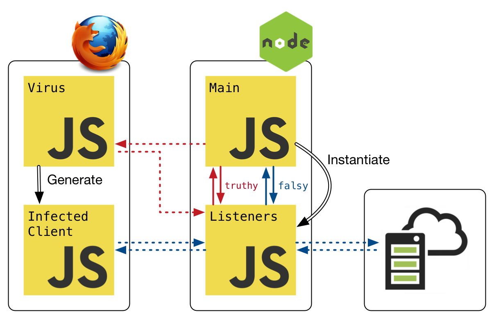

# Otiluke 

Toolbox for deploying JavaScript code transformers written in JavaScript themselves on node and browsers.

## Virus Interface

In Otiluke, code transformers should adhere to the virus interface.
A virus is a function which receives an [Antena](https://github.com/lachrist/antena) (isomorphic http client) as well as a set of options entered by the user and it should asynchronously return a code transformation function.
A virus module is a commonjs module exporting a virus function.

```js
module.exports = (antena, options, callback) => {
  // Perform setup
  if (something_went_wrong) {
    callback(error);
  } else {
    callback(null, (script, source) => {
      // Transform source
      return transformed_source;
    });
  }
};
```

## OtilukeBrowser

OtilukeBrowser modifies html pages served over http(s) by performing a man-in-the-middle attack with a forward proxy.
Such attack requires the browser to redirect all its request to the forward proxy.
For pages securely served over https it also requires the browser to trust the self-signed certificate at [browser/ca/cert.pem](browser/ca/cert.pem).
Examples: [test/browser-hello.sh](test/browser-hello.sh) and [test/browser-google.sh](test/browser-hello.sh).



### `require("otiluke/browser/ca").initialize(options)`

Upon calling this module, Otiluke will prepare a directory to serve as a certificate authority.
That the end, this directory will be populated with the subdirectories: `req`, `key` and `cert` and the files: `req.pem`, `key.pem` and `cert.pem`.
To make a browser trust Otiluke, you will need to import `cert.pem` which is Otiluke's root certificate.

**Warning**
Making a browser trust a root certificate implies *serious* security consequences.
Everyone having access to the corresponding private key can falsify *any* identity on that browser (which is exactly what OtilukeBrowser needs to do).
To avoid security breach, we recommend to use a dedicated browser and *never* fill in it any sensitive information.

```js
require("otiluke/browser/ca").initialize({home, subj})
```

* `home :: string`, default `"node_modules/otiluke/browser/ca-home"`:
  Path to a certificate authority directory.
* `subj :: string`, default `"/CN=otiluke/O=Otiluke"`:
  The `-subj` argument to pass to [`openssl -req`](https://www.openssl.org/docs/manmaster/man1/req.html).

```
otiluke-browser-ca --initialize [--home <path>] [--subj arg]
```

* `--home`, default `node_modules/otiluke/browser/ca-home`:
  Path to a certificate authority directory.
* `--subj`, default `/CN=otiluke/O=Otiluke`:
  The `-subj` argument to pass to [`openssl -req`](https://www.openssl.org/docs/manmaster/man1/req.html).

### `proxy = require("otiluke/browser/proxy")(vpath, options)`

Create a man-in-the-middle proxy.

```js
proxy = require("otiluke/browser/proxy")(virus_path, {"ca-home":ca_home, "url-search-prefix":url_search_prefix, "http-splitter":http_splitter, "global-variable":global_variable});
```

* `virus_path :: string`:
  Path to a virus module.
* `ca_home :: string`, default `"node_modules/otiluke/browser/ca-home"`
  Path to a certificate authority directory.
* `url_search_prefix :: string`, default `"otiluke-"`:
  Url search prefix for creating the `options` object to pass to the virus module.
  For instance, the url `http://example.com/path?otiluke-foo=123&otiluke-bar=456&qux=789` will result into `{foo:123, bar:456}` being passed to the virus module.
* `http_splitter :: string`, default random value.
  Marker for recognizing communication from the virus module.
* `global_variable :: string`, default random value.
  Global variable name used to store the transformation function asynchronously returned by the virus module.
* `proxy :: object`
  An imitation of a regular `http.Server`.
    * Event: `request`
      * `request :: http.IncomingMessage`
      * `response :: http.ServerResponse`
    * Event: `upgrade`
      * `request :: http.IncomingMessage`
      * `socket :: Net.Socket`
      * `head :: buffer`
    * Event: `listening`
    * Event: `close`
      * `hadError :: boolean`
    * Event: `error`
      * `error :: Error`
      * `location :: string`
      * `origin :: events.EventEmitter`
    * `proxy.listen(port, callback)`
    * `proxy.close(callback)`
    * `proxy.address()`

### Redirect Firefox requests to the man-in-the-middle proxy

Go to `about:preferences`, at the bottom of the *General* menu, click on *Settings...*.
Tick the checkbox *Manual proxy configuration* and *Use this proxy server for all protocols*.
The *HTTP Proxy* field should be *localhost* and the *Port* field should refer to the port to which is the proxy is listening.


### Make Firefox trust Otiluke's root certificate

This step is only required if you need to infect html pages securely served over https.
Go to `about:preferences`, at the bottom of the *Privacy & Security* menu, click on *View Certificates*.
Import Otiluke's root certificate an restart Firefox to avoid `sec_error_reused_issuer_and_serial` error.


## OtilukeNode

OtilukeNode infects node applications by modifying the require procedure performed by node.
See [test/node.sh](test/node.sh) for example.


### `require("otiluke/node")(virus, command, antena_options, virus_options)`

```js
require("otiluke/node")(virus, [main, ...argv], {host, secure}, virus_options);
```

* `virus :: function`:
  A virus function.
* `main :: string`:
  Path to main module.
* `argv :: [string]`:
  Command line arguments.
* `host :: number | string | null` default `null`:
  A local port number or `hostname:port` or a Unix domain socket or a Windows pipe.
  If `null` the `antena` passed to the virus module will be `null`.
* `secure :: boolean`:
  Indicates whether the `antena` argument passed to `virus` should perform remote communication.
  Non applicable if `host` is `null`.
* `virus_options :: *`:
  The `options` argument to pass `virus`.

```
otiluke --virus <path> [--host <number|path|host>] [--secure]  ... -- <target-command>`
```

* `--virus`:
  Path to a virus module.
* `--host <number|path|host>`:
  Defines the host to which the `antena` passed to the virus module should be directed.
    * `number`: Local port.
    * `path`: Unix domain socket or windows pipe.
    * `host`: `hostname[:port]`.
* `[--secure]`
  Tells if the `antena` passed to the virus module should perform secure communication.
* `...`
  Additional arguments will be passed as `options` properties to the virus module. 
* `--`:
  The double dash separates Otiluke-related arguments from the target node command.

